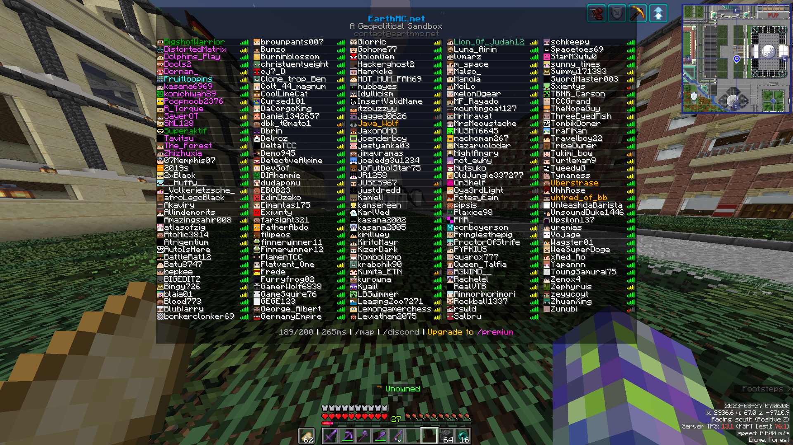

<p align="center">
  

---

# Tabby
Tabby is a highly customisable Fabric mod for Minecraft that adds extra utility to the tab list such as:
- Configurable settings to change the amount of players shown and the amount of rows
- A highly configurable file to define groups of name colours and formats, full RGB and Minecraft formatting, read [here](#groups-config) for setup help
- Option to remove or change the headers and footers on tab, no more obnoxious advertising

Join my Discord at https://discord.gg/ey6ZvnwAJp for support and discussion.

<p align="center">
    

## Installation
Download the mod from [here](https://github.com/Fruitloopins/Tabby/releases/latest)

Additionally, this mod requires:
- [Cloth Config API](https://modrinth.com/mod/cloth-config)
- [Fabric API](https://modrinth.com/mod/fabric-api)
- and optionally (highly recommended) [Mod Menu](https://modrinth.com/mod/modmenu) to view the config

You will most likely have some, or all of these dependencies installed if you already use Fabric mods.

If you have never used or installed Fabric before, learn how to install it [here](https://fabricmc.net/wiki/install)

Once you have downloaded all the above mods, place them in `.minecraft/mods`, read below for help with that.

### Navigating to .minecraft
Read [here](https://minecraft.fandom.com/wiki/.minecraft#Locating_.minecraft) for a guide for your OS on how to do navigate to the .minecraft directory.

## Groups Config
> Launch Minecraft with Tabby installed before following this guide to create the relevant files

If you would like to customise the formatting of specific usernames in tab, you must navigate to your ".minecraft" folder, read [here](#navigating-to-minecraft) for help with that. There is regrettably no in-game editor for this functionality as of now.

Once you have reached the .minecraft directory, navigate to `.minecraft/config/Tabby`. You will find that there is already a file here named "groups.json", the groups defined by default in this file are staff of the server I develop for, EarthMC.

You are free to edit this file as you like, however, it is important that you follow the structure I have laid out. Below is an example of the "bare minimum":
```json
[
  {
    "group": "Friends",
    "colour": "GOLD",
    "bold": true,
    "italic": false,
    "underline": true,
    "strikethrough": false,
    "obfuscated": false,
    "usernames": [
      "fed0ec4a-f1ad-4b97-9443-876391668b34",
      "Uberstrase"
    ]
  }
]
```

If you don't understand what you are doing when editing this file you should just replace the default values I have already put there rather than attempting to start from scratch. If you have made an irreparable mistake you can delete the file or folder and restart your client to re-initialise the file.

- "group" can be any string you like
- UUIDs are a valid input for usernames
- "colour" can be any of the colours listed [here](https://www.digminecraft.com/lists/color_list_pc.php) i.e. BLACK, DARK_AQUA, RED etc. or you can choose a hexadecimal number, i.e. 4A412A
- All boolean values (bold-obfuscated) must be present even if you are not setting them to true

You can define as many groups as you like. If you make changes while in-game, you can press F9 to reload them on the fly. This is due to the JSON being cached to prevent lag.